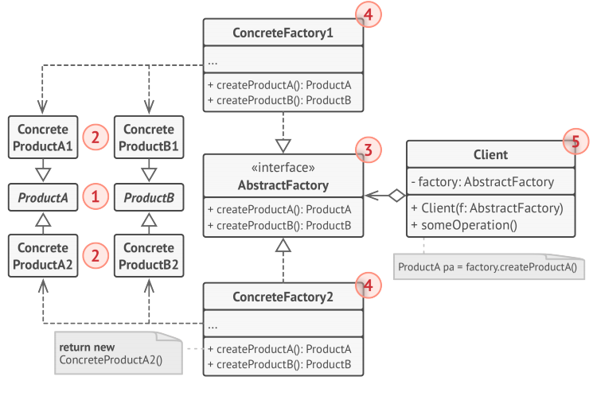
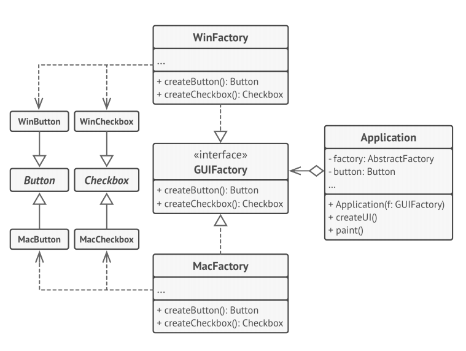

# Abstract Factory
**Abstract Factory** is a creational design pattern that lets you produce families of related 
objects without specifying their concrete classes.

## Solution
The first thing the Abstract Factory pattern suggests is to explicitly declare interfaces for 
each distinct product of the product family (e.g., chair, sofa or coffee table). Then you can 
make all variants of products follow those interfaces. For example, all chair variants can 
implement the Chair interface; all coffee table variants can implement the CoffeeTable 
interface, and so on.

## Structure

1. **Abstract Products** declare interfaces for a set of distinct but related products which make up a product family.
2. **Concrete Products** are various implementations of abstract products, grouped by 
variants. Each abstract product (chair/sofa) must be implemented in all given variants 
(Victorian/Modern).
3. The **Abstract Factory** interface declares a set of methods for creating each of the abstract products.
4. **Concrete Factories** implement creation methods of the abstract factory. Each concrete 
factory corresponds to a specific variant of products and creates only those product variants.
5. Although concrete factories instantiate concrete products, signatures of their creation 
methods must return corresponding abstract products. This way the client code that uses a 
factory doesn’t get coupled to the specific variant of the product it gets from a factory. The 
**Client** can work with any concrete factory/product variant, as long as it communicates with 
their objects via abstract interfaces.

## Pseudocode
This example illustrates how the Abstract Factory pattern can be used for creating 
cross-platform UI elements without coupling the client code to concrete UI classes, while 
keeping all created elements consistent with a selected operating system.

## How to Implement
1. Map out a matrix of distinct product types versus variants of these products.
1. Declare abstract product interfaces for all product types. Then make all concrete product 
classes implement these interfaces.
1. Declare the abstract factory interface with a set of creation
methods for all abstract products.
1. Implement a set of concrete factory classes, one for each product variant.
1. Create factory initialization code somewhere in the app. It should instantiate one of the 
concrete factory classes, depending on the application configuration or the current 
environment. Pass this factory object to all classes that construct products.
1. Scan through the code and find all direct calls to product constructors. Replace them with 
calls to the appropriate creation method on the factory object.

