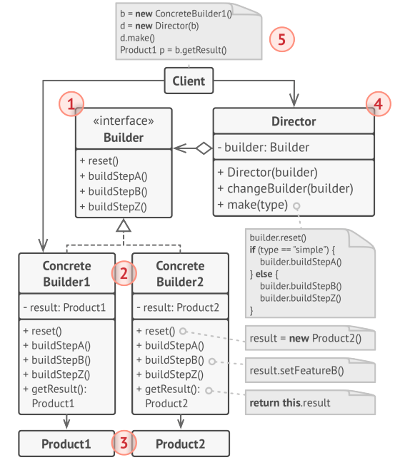
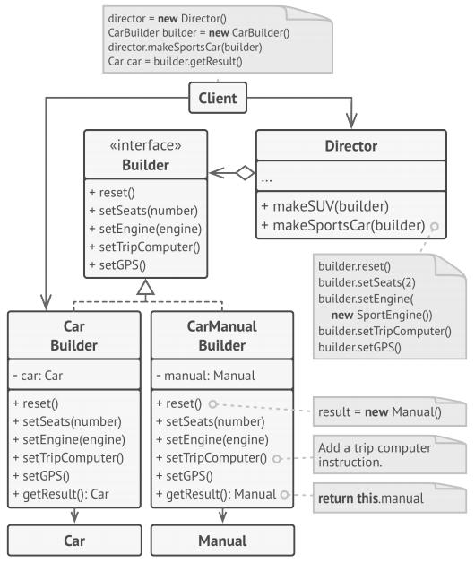

# Builder
**Builder** is a creational design pattern that lets you construct complex objects step by 
step. The pattern allows you to produce different types and representations of an object using
the same construction code.

## Solution
The Builder pattern suggests that you extract the object construction code out of its own 
class and move it to separate objects called _builders_.

### Director
You can go further and extract a series of calls to the builder steps you use to construct a 
product into a separate class called _director_. The director class defines the order in which
to execute the building steps, while the builder provides the implementation for those steps.

In addition, the director class completely hides the details of product construction from the 
client code. The client only needs to associate a builder with a director, launch the 
construction with the director, and get the result from the builder.

## Structure

1. The Builder interface declares product construction steps that are common to all types of 
builders.
1. Concrete Builders provide different implementations of the construction steps. Concrete 
builders may produce products that don’t follow the common interface.
1. Products are resulting objects. Products constructed by different builders don’t have to 
belong to the same class hierarchy or interface.
1. The Director class defines the order in which to call construction steps, so you can create 
and reuse specific configurations of products.
1. The Client must associate one of the builder objects with the director. Usually, it’s done 
just once, via parameters of the director’s constructor. Then the director uses that builder
object for all further construction. However, there’s an alternative approach for when the 
client passes the builder object to the production method of the director. In this case, you 
can use a different builder each time you produce something with the director.

## psuedocode
This example of the Builder pattern illustrates how you can reuse the same object construction 
code when building different types of products, such as cars, and create the corresponding 
manuals for them.

## How to Implement
1. Make sure that you can clearly define the common construction steps for building all 
available product representations. Otherwise, you won’t be able to proceed with implementing
the pattern.
1. Declare these steps in the base builder interface.
1. Create a concrete builder class for each of the product representations and implement their 
construction steps.

Don’t forget about implementing a method for fetching the result of the construction. The 
reason why this method can’t be declared inside the builder interface is that various builders
may construct products that don’t have a common interface.
Therefore, you don’t know what would be the return type for such a method. However, if you’re 
dealing with products from a single hierarchy, the fetching method can be safely added to the 
base interface.
1. Think about creating a director class. It may encapsulate various ways to construct a 
product using the same builder object.
1. The client code creates both the builder and the director objects. Before construction 
starts, the client must pass a builder object to the director. Usually, the client does this 
only once, via parameters of the director’s constructor. The director uses the builder object 
in all further construction. There’s an alternative approach, where the builder is passed 
directly to the construction method of the director.
1. The construction result can be obtained directly from the director only if all products 
follow the same interface. Otherwise, the client should fetch the result from the builder.

