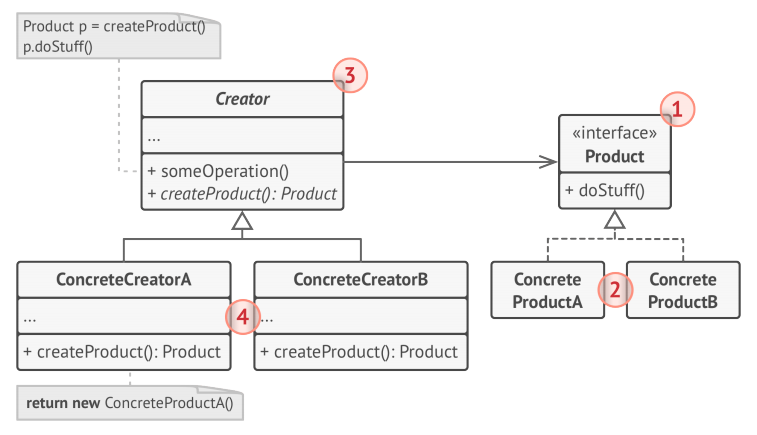
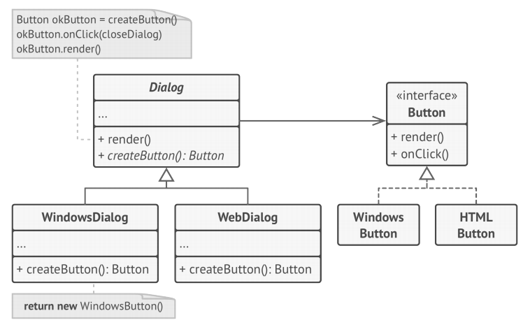

# Factory Method
**Factory Method** is a creational design pattern that provides an interface for 
creating objects in a superclass, but allows subclasses to alter the type of objects 
that will be created.

## Solution
The Factory Method pattern suggests that you replace direct object construction calls 
(using the new operator) with calls to a special factory method. Don’t worry: the 
objects are still created via the new operator, but it’s being called from within the 
factory method. Objects returned by a factory method are often referred to as 
“products.”

There’s a slight limitation though: subclasses may return different types of products 
only if these products have a common base class or interface. Also, the factory 
method in the base class should have its return type declared as this interface.

## Struture

1. The **Product** declares the interface, which is common to all objects that can be produced by the creator and its subclasses.
1. **Concrete Products** are different implementations of the product interface.
3. The **Creator** class declares the factory method that returns new product objects. It’s 
important that the return type of this method matches the product interface.

You can declare the factory method as abstract to force all subclasses to implement their own 
versions of the method. As an alternative, the base factory method can return some default 
product type.

**NOTE**, despite its name, product creation is not the primary responsibility of the creator. 
Usually, the creator class already has some core business logic related to products. The 
factory method helps to decouple this logic from the concrete product classes. Here is an 
analogy: a large software development company can have a training department for programmers.
However, the primary function of the company as a whole is still writing code, not producing 
programmers.

1. Concrete Creators override the base factory method so it returns a different type of product.

**NOTE**: that the factory method doesn’t have to create new instances all the time. It can 
also return existing objects from a cache, an object pool, or another source.

## pseudocode
This example illustrates how the Factory Method can be used for creating cross-platform UI 
elements without coupling the client code to concrete UI classes.

The base dialog class uses different UI elements to render its window. Under various operating 
systems, these elements may look a little bit different, but they should still behave 
consistently. A button in Windows is still a button in Linux.

## How to implement
1. Make all products follow the same interface. This interface should declare methods that 
make sense in every product.
1. Add an empty factory method inside the creator class. The return type of the method should 
match the common product interface.
1. In the creator’s code find all references to product constructors. One by one, replace them 
with calls to the factory method, while extracting the product creation code into the factory
method.

You might need to add a temporary parameter to the factory method to control the type of 
returned product.

At this point, the code of the factory method may look pretty ugly. It may have a large switch 
operator that picks which product class to instantiate. But don’t worry, we’ll fix it soon
enough.

1. Now, create a set of creator subclasses for each type of product listed in the factory 
method. Override the factory method in the subclasses and extract the appropriate bits of 
construction code from the base method.

1. If there are too many product types and it doesn’t make sense to create subclasses for all 
of them, you can reuse the control parameter from the base class in subclasses.

## Hurray!!!!
