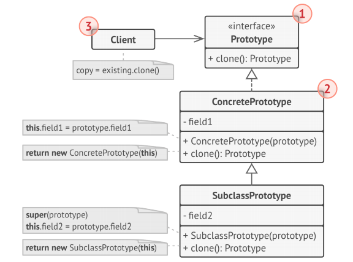
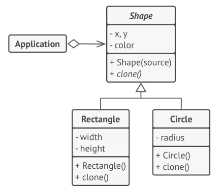

# Prototype
**Prototype** is a creational design pattern that lets you copy existing objects without 
making your code dependent on their classes.

## Solution 
The Prototype pattern delegates the cloning process to the actual objects that are being 
cloned. The pattern declares a common interface for all objects that support cloning. This
interface lets you clone an object without coupling your code to the class of that object. 
Usually, such an interface contains just a single clone method.

The implementation of the clone method is very similar in all classes. The method creates an 
object of the current class and carries over all of the field values of the old object into the
new one. You can even copy private fields because most programming languages let objects 
access private fields of other objects that belong to the same class.

An object that supports cloning is called a prototype. When your objects have dozens of fields 
and hundreds of possible configurations, cloning them might serve as an alternative to
subclassing.

## Structure

1. The **Prototype interface** declares the cloning methods. In most cases, it’s a single clone method.
1. The **Concrete Prototype** class implements the cloning method.
In addition to copying the original object’s data to the clone, this method may also handle 
some edge cases of the cloning process related to cloning linked objects, untangling recursive
dependencies, etc.
1. The Client can produce a copy of any object that follows the prototype interface.

### Prototype registry implementation

1. The Prototype Registry provides an easy way to access frequently-used prototypes. It stores 
a set of pre-built objects that are ready to be copied. The simplest prototype registry is a 
name → prototype hash map. However, if you need better search criteria than a simple name, you 
can build a much more robust version of the registry.

## Pseudocode
In this example, the Prototype pattern lets you produce exact copies of geometric objects, 
without coupling the code to their classes.

All shape classes follow the same interface, which provides a cloning method. A subclass may 
call the parent’s cloning method before copying its own field values to the resulting object.

## How to Implement
1. Create the prototype interface and declare the clone method in it. Or just add the method 
to all classes of an existing class hierarchy, if you have one.

1. A prototype class must define the alternative constructor that accepts an object of that 
class as an argument. The constructor must copy the values of all fields defined in the class 
from the passed object into the newly created instance. If you’re changing a subclass, you 
must call the parent constructor to let the superclass handle the cloning of its private 
fields.

If your programming language doesn’t support method overloading, you may define a special  
method for copying the object data. The constructor is a more convenient place to do this 
because it delivers the resulting object right after you call the new operator.

1. The cloning method usually consists of just one line: running a new operator with the 
prototypical version of the constructor. Note, that every class must explicitly override the 
cloning method and use its own class name along with the new operator. Otherwise, the cloning 
method may produce an object of a parent class.

1. Optionally, create a centralized prototype registry to store a catalog of frequently used 
prototypes.

You can implement the registry as a new factory class or put it in the base prototype class 
with a static method for fetching the prototype. This method should search for a prototype 
based on search criteria that the client code passes to the method. The criteria might either 
be a simple string tag or a complex set of search parameters. After the appropriate prototype 
is found, the registry should clone it and return the copy to the client.

Finally, replace the direct calls to the subclasses’ constructors with calls to the factory 
method of the prototype registry.

