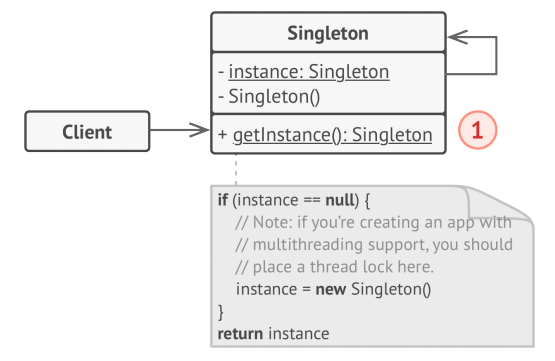

# Singleton
**Singleton** is a creational design pattern that lets you ensure that a class has only 
one instance, while providing a global access point to this instance.

## Solution
All implementations of the Singleton have these two steps in common:
* Make the default constructor private, to prevent other objects from using the 
_new_ operator with the Singleton class.
* Create a static creation method that acts as a constructor. Under the hood, this 
method calls the private constructor to create an object and saves it in a static field. 
All following calls to this method return the cached object.

If your code has access to the Singleton class, then it’s able to call the Singleton’s 
static method. So whenever that method is called, the same object is always returned.

## Structure

1. The Singleton class declares the static method _getInstance_ that returns the same 
instance of its own class. The Singleton’s constructor should be hidden from the client
code. Calling the getInstance method should be the only way of getting 
the Singleton object.

## Pseudocode
In this example, the database connection class acts as a **Singleton**.

This class doesn’t have a public constructor, so the only way to get its object is 
to call the getInstance method. This method caches the first created object and 
returns it in all subsequent calls.

## How to Implement
1. Add a private static field to the class for storing the singleton instance.
2. Declare a public static creation method for getting the singleton instance.
3. Implement “lazy initialization” inside the static method. It should create a new 
object on its first call and put it into the static field. The method should 
always return that instance on all subsequent calls.
4. Make the constructor of the class private. The static method of the class will 
still be able to call the constructor, but not the other objects.
5. Go over the client code and replace all direct calls to the singleton’s 
constructor with calls to its static creation method.

