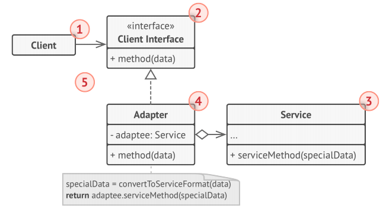
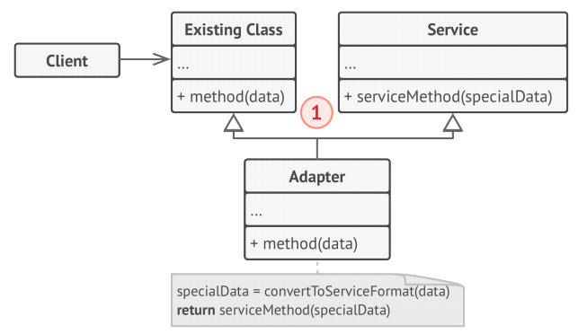
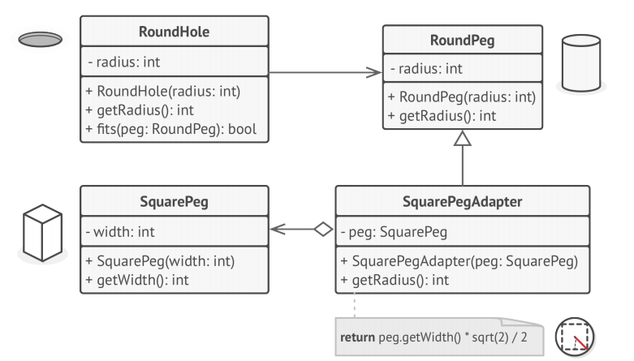

# Adapter
**Adapter** is a structural design pattern that allows objects with incompatible interfaces to collaborate.

## problem
Imagine that you’re creating a stock market monitoring app. The app downloads the stock data 
from multiple sources in XML format and then displays nice-looking charts and diagrams for the user.

At some point, you decide to improve the app by integrating a smart 3rd-party analytics 
library. But there’s a catch: the analytics library only works with data in JSON format.

You could change the library to work with XML. However, this might break some existing code 
that relies on the library. And worse, you might not have access to the library’s source code
in the first place, making this approach impossible.

## Solution
You can create an **adapter**. This is a special object that converts the interface of one 
object so that another object can understand it.

An adapter wraps one of the objects to hide the complexity of conversion happening behind the 
scenes. The wrapped object isn’t even aware of the adapter. For example, you can wrap an 
object that operates in meters and kilometers with an adapter that converts all of the data to 
imperial units such as feet and miles.

Adapters can not only convert data into various formats but can also help objects with 
different interfaces collaborate.

Here’s how it works:
1. The adapter gets an interface, compatible with one of the existing objects.
2. Using this interface, the existing object can safely call the adapter’s methods.
3. Upon receiving a call, the adapter passes the request to the second object, but in a format and order that the second object expects.

Sometimes it’s even possible to create a two-way adapter that can convert the calls in both directions.

## Structure
**Object adapter**
This implementation uses the composition principle: the adapter implements the interface of 
one object and wraps the other one. It can be implemented in all popular programming
languages.

1. The **Client** is a class that contains the existing business logic of the program.
1. The **Client Interface** describes a protocol that other classes must follow to be able to 
collaborate with the client code.
1. The **Service** is some useful class (usually 3rd-party or legacy). The client can’t use 
this class directly because it has an incompatible interface.
1. The **Adapter** is a class that’s able to work with both the client and the service: it 
implements the client interface, while wrapping the service object. The adapter receives calls 
from the client via the adapter interface and translates them into calls to the wrapped 
service object in a format it can understand.
1. The client code doesn’t get coupled to the concrete adapter class as long as it works with 
the adapter via the client interface. Thanks to this, you can introduce new types of adapters
into the program without breaking the existing client code.

This can be useful when the interface of the service class gets changed or replaced: you can 
just create a new adapter class without changing the client code.

**Class adapter**
This implementation uses inheritance: the adapter inherits interfaces from both objects at the 
same time. Note that this approach can only be implemented in programming languages that 
support multiple inheritance, such as C++.

1. The **Class Adapter** doesn’t need to wrap any objects because it inherits behaviors from both the client and the service. The adaptation happens within the overridden methods. The
resulting adapter can be used in place of an existing client class.

## Psuedocode
This example of the Adapter pattern is based on the classic conflict between square pegs and round holes.

The Adapter pretends to be a round peg, with a radius equal to a half of the square’s diameter 
(in other words, the radius of the smallest circle that can accommodate the square peg).

## How to Implement
1. Make sure that you have at least two classes with incompatible interfaces:
    * A useful service class, which you can’t change (often 3rdparty, legacy or with lots of existing dependencies).
    * One or several client classes that would benefit from using the service class.
1. Declare the client interface and describe how clients communicate with the service.
1. Create the adapter class and make it follow the client interface. Leave all the methods 
empty for now.
1. Add a field to the adapter class to store a reference to the service object. The common 
practice is to initialize this field via the constructor, but sometimes it’s more convenient 
to pass it to the adapter when calling its methods.
1. One by one, implement all methods of the client interface in the adapter class. The adapter 
should delegate most of the real work to the service object, handling only the interface or
data format conversion.
1. Clients should use the adapter via the client interface. This will let you change or extend 
the adapters without affecting the client code.
