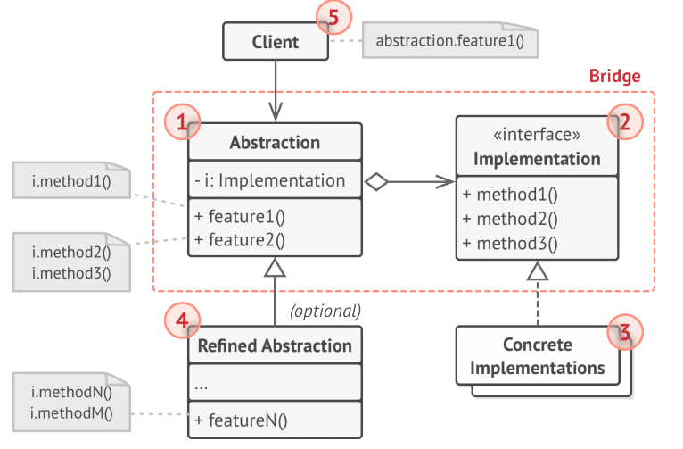
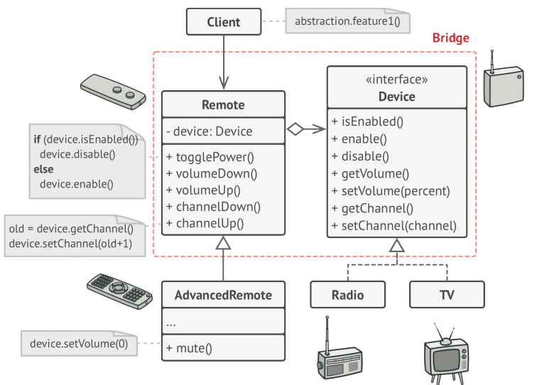

# Bridge
**Bridge** is a structural design pattern that lets you split a large class or a set of 
closely related classes into two separate hierarchies—abstraction and implementation—which can 
be developed independently of each other.

## Problem
Abstraction? Implementation? Sound scary? Stay calm and let’s consider a simple example.

## Solution
This problem occurs because we’re trying to extend the shape classes in two independent 
dimensions: by form and by color. That’s a very common issue with class inheritance.

The Bridge pattern attempts to solve this problem by switching from inheritance to 
composition. What this means is that you extract one of the dimensions into a separate class 
hierarchy, so that the original classes will reference an object of the new hierarchy, instead 
of having all of its state and behaviors within one class.

## Abstraction and Implementation
The GoF book introduces the terms _Abstraction_ and _Implementation_ as part of the Bridge 
definition. In my opinion, the terms sound too academic and make the pattern seem more 
complicated than it really is. Having read the simple example with shapes and colors, let’s 
decipher the meaning behind the GoF book’s scary words.

_Abstraction_ (also called **_interface_**) is a high-level control layer for some entity. 
This layer isn’t supposed to do any real work on its own. It should delegate the work to the 
_implementation_ layer (also called _platform_).

Note that we’re not talking about _interfaces_ or _abstract classes_ from your programming 
language. These aren’t the same things.

When talking about real applications, the abstraction can be represented by a graphical user 
interface (GUI), and the implementation could be the underlying operating system code (API) 
which the GUI layer calls in response to user interactions.

Generally speaking, you can extend such an app in two independent directions:
* Have several different GUIs (for instance, tailored for regular customers or admins).
* Support several different APIs (for example, to be able to launch the app under Windows, Linux, and MacOS).

In a worst-case scenario, this app might look like a giant spaghetti bowl, where hundreds of 
conditionals connect different types of GUI with various APIs all over the code.

You can bring order to this chaos by extracting the code related to specific 
interface-platform combinations into separate classes. However, soon you’ll discover that 
there are lots of these classes. The class hierarchy will grow exponentially because adding a 
new GUI or supporting a different API would require creating more and more classes.

Let’s try to solve this issue with the Bridge pattern. It suggests that we divide the classes into two hierarchies:
* Abstraction: the GUI layer of the app.
* Implementation: the operating systems’ APIs.

The abstraction object controls the appearance of the app, delegating the actual work to the 
linked implementation object. Different implementations are interchangeable as long as they 
follow a common interface, enabling the same GUI to work under Windows and Linux.

As a result, you can change the GUI classes without touching the API-related classes. Moreover,
 adding support for another operating system only requires creating a subclass in the
implementation hierarchy.

## Structure

1. The **Abstraction** provides high-level control logic. It relies on the implementation 
object to do the actual low-level work.

1. The **Implementation** declares the interface that’s common for all concrete 
implementations. An abstraction can only communicate with an implementation object via methods 
that are declared here.

The abstraction may list the same methods as the implementation, but usually the abstraction 
declares some complex behaviors that rely on a wide variety of primitive operations declared 
by the implementation.

1. **Concrete Implementations** contain platform-specific code.

1. **Refined Abstractions** provide variants of control logic. Like their parent, they work 
with different implementations via the general implementation interface.

1. Usually, the **Client** is only interested in working with the abstraction. However, it’s 
the client’s job to link the abstraction object with one of the implementation objects.

## Pseudocode
This example illustrates how the **Bridge** pattern can help divide the monolithic code of an 
app that manages devices and their remote controls. The Device classes act as the 
implementation, whereas the Remote s act as the abstraction.

The base remote control class declares a reference field that links it with a device object. 
All remotes work with the devices via the general device interface, which lets the same remote
support multiple device types.

The original class hierarchy is divided into two parts: devices and remote controls.

You can develop the remote control classes independently from the device classes. All that’s 
needed is to create a new remote subclass. For example, a basic remote control might only have 
two buttons, but you could extend it with additional features, such as an extra battery or a 
touchscreen.

The client code links the desired type of remote control with a specific device object via the 
remote’s constructor.

## How to Implement
1. Identify the orthogonal dimensions in your classes. These independent concepts could be: 
abstraction/platform, domain/infrastructure, front-end/back-end, or interface/implementation.
1. See what operations the client needs and define them in the base abstraction class.
1. Determine the operations available on all platforms. Declare the ones that the abstraction 
needs in the general implementation interface.
1. For all platforms in your domain create concrete implementation classes, but make sure they 
all follow the implementation interface.
1. Inside the abstraction class, add a reference field for the implementation type. The 
abstraction delegates most of the work to the implementation object that’s referenced in that 
field.
1. If you have several variants of high-level logic, create refined abstractions for each 
variant by extending the base abstraction class.
1. The client code should pass an implementation object to the abstraction’s constructor to 
associate one with the other. After that, the client can forget about the implementation and 
work only with the abstraction object.
