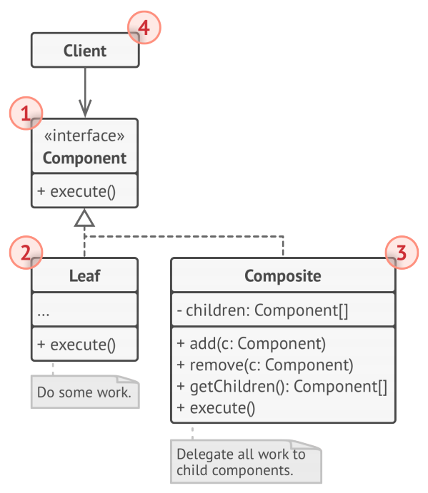
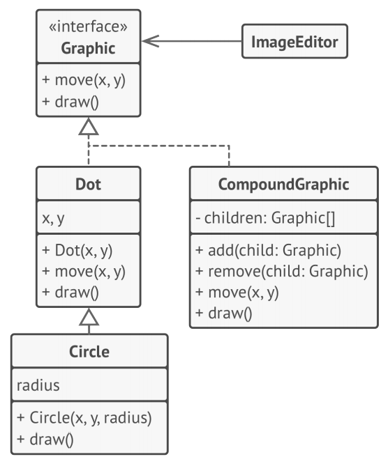

# Composite
**Composite** is a structural design pattern that lets you compose objects into tree 
structures and then work with thes structures as if they were individual objects.

## Problem
Using the Composite pattern makes sense only when the core model of your app can be 
represented as a tree.

Example:- An order might comprise various products, packaged in boxes, which are packaged in 
bigger boxes and so on. The whole structure looks like an upside down tree.

## Solution
The Composite pattern suggests that you work with Products and Boxes through a common 
interface which declares a method for calculating the total price.

How would this method work? For a product, it’d simply return the product’s price. For a box, 
it’d go over each item the box contains, ask its price and then return a total for this box. If
one of these items were a smaller box, that box would also start going over its contents and 
so on, until the prices of all inner components were calculated. A box could even add some
extra cost to the final price, such as packaging cost.

The greatest benefit of this approach is that you don’t need to care about the concrete 
classes of objects that compose the tree. You don’t need to know whether an object is a simple
product or a sophisticated box. You can treat them all the same via the common interface. When 
you call a method, the objects themselves pass the request down the tree.

## Structure

1. The Component interface describes operations that are common to both simple and complex 
elements of the tree.
1. The Leaf is a basic element of a tree that doesn’t have sub-elements. Usually, leaf 
components end up doing most of the real work, since they don’t have anyone to delegate the 
work to.
1. The Container (aka composite) is an element that has sub-elements: leaves or other 
containers. A container doesn’t know the concrete classes of its children. It works with all 
sub-elements only via the component interface.

Upon receiving a request, a container delegates the work to its sub-elements, processes 
intermediate results and then returns the final result to the client.
1. The Client works with all elements through the component interface. As a result, the client 
can work in the same way with both simple or complex elements of the tree.

## Pseudocode
In this example, the Composite pattern lets you implement stacking of geometric shapes in a 
graphical editor.

The CompoundGraphic class is a container that can comprise any number of sub-shapes, including 
other compound shapes. A compound shape has the same methods as a simple shape. However,
instead of doing something on its own, a compound shape passes the request recursively to all 
its children and “sums up” the result.

The client code works with all shapes through the single interface common to all shape 
classes. Thus, the client doesn’t know whether it’s working with a simple shape or a compound 
one. The client can work with very complex object structures without being coupled to concrete 
classes that form that structure.

## How to Implement
1. Make sure that the core model of your app can be represented as a tree structure. Try to 
break it down into simple elements and containers. Remember that containers must be able to 
contain both simple elements and other containers.
1. Declare the component interface with a list of methods that make sense for both simple and 
complex components.
1. Create a leaf class to represent simple elements. A program may have multiple different 
leaf classes.
1. Create a container class to represent complex elements. In this class, provide an array 
field for storing references to subelements. The array must be able to store both leaves and
containers, so make sure it’s declared with the component interface type.

While implementing the methods of the component interface, remember that a container is 
supposed to be delegating most of the work to sub-elements.
1. Finally, define the methods for adding and removal of child elements in the container.
Keep in mind that these operations can be declared in the component interface. This would 
violate the Interface Segregation Principle because the methods will be empty in the leaf
class. However, the client will be able to treat all the elements equally, even when composing 
the tree.

