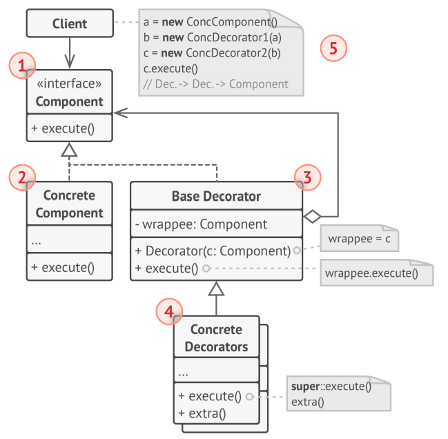
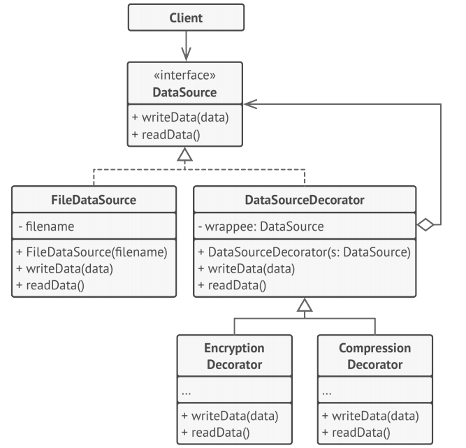

# Decorator
Decorator is a structural design pattern that lets you attach new behaviors to objects by 
placing these objects inside special wrapper objects that contain the behaviors.

## Problem
Imagine that you’re working on a notification library which lets other programs notify their 
users about important events.

## Solution
Extending a class is the first thing that comes to mind when you need to alter an object’s 
behavior. However, inheritance has several serious caveats that you need to be aware of.
* Inheritance is static. You can’t alter the behavior of an existing object at runtime. You 
can only replace the whole object with another one that’s created from a different subclass.
* Subclasses can have just one parent class. In most languages, inheritance doesn’t let a 
class inherit behaviors of multiple classes at the same time.

One of the ways to overcome these caveats is by using Composition instead of Inheritance. With 
composition one object has a reference to another and delegates it some work, whereas with
inheritance, the object itself is able to do that work, inheriting the behavior from its 
superclass.

With composition, you can easily substitute the linked “helper” object with another, changing 
the behavior of the container at runtime. An object can use the behavior of various classes,
having references to multiple objects and delegating them all kinds of work.

Composition is the key principle behind many design patterns, including the Decorator. On that 
note, let’s return to the pattern discussion.

__*Wrapper*__ is the alternative nickname for the Decorator pattern that clearly expresses the 
main idea of the pattern. A “wrapper” is an object that can be linked with some “target” 
object. The wrapper contains the same set of methods as the target and delegates to it all 
requests it receives. However, the wrapper may alter the result by doing something either 
before or after it passes the request to the target.

When does a simple wrapper become the real decorator? As I mentioned, the wrapper implements 
the same interface as the wrapped object. That’s why from the client’s perspective these
objects are identical. Make the wrapper’s reference field accept.

## Structure

1. The **Component** declares the common interface for both wrappers and wrapped objects.
1. **Concrete Component** is a class of objects being wrapped. It defines the basic behavior, 
which can be altered by decorators.
1. The **Base Decorator** class has a field for referencing a wrapped object. The field’s type 
should be declared as the component interface so it can contain both concrete components and 
decorators. The base decorator delegates all operations to the wrapped object.
1. **Concrete Decorators** define extra behaviors that can be added to components dynamically. 
Concrete decorators override methods of the base decorator and execute their behavior either 
before or after calling the parent method.
1. The **Client** can wrap components in multiple layers of decorators, as long as it works 
with all objects via the component interface.

## Psuedocode
In this example, the **Decorator** pattern lets you compress and encrypt sensitive data 
independently from the code that actually uses this data.

The application wraps the data source object with a pair of decorators. Both wrappers change 
the way the data is written to and read from the disk:

* Just before the data is written to disk, the decorators encrypt and compress it. The 
original class writes the encrypted and protected data to the file without knowing about the 
change.
* Right after the data is read from disk, it goes through the same decorators, which 
decompress and decode it.

The decorators and the data source class implement the same interface, which makes them all 
interchangeable in the client code.

## How to Implement
1. Make sure your business domain can be represented as a primary component with multiple 
optional layers over it.
1. Figure out what methods are common to both the primary component and the optional layers. 
Create a component interface and declare those methods there.
1. Create a concrete component class and define the base behavior in it.
1. Create a base decorator class. It should have a field for storing a reference to a wrapped 
object. The field should be declared with the component interface type to allow linking to 
concrete components as well as decorators. The base decorator must delegate all work to the 
wrapped object.
1. Make sure all classes implement the component interface.
1. Create concrete decorators by extending them from the base decorator. A concrete decorator 
must execute its behavior before or after the call to the parent method (which always 
delegates to the wrapped object).
1. The client code must be responsible for creating decorators and composing them in the way 
the client needs.

