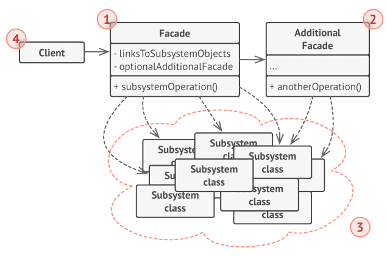
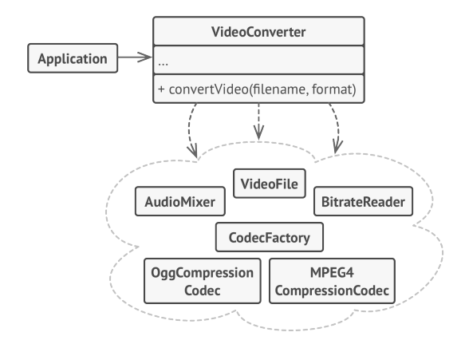

# Facade
**Facade** is a structural design pattern that provides a simplified interface to a library, a 
framework, or any other complex set of classes.

## Problem
Imagine that you must make your code work with a broad set of objects that belong to a 
sophisticated library or framework. Ordinarily, you’d need to initialize all of those objects, 
keep track of dependencies, execute methods in the correct order, and so on.

As a result, the business logic of your classes would become tightly coupled to the 
implementation details of 3rd-party classes, making it hard to comprehend and maintain.

## Solution
A facade is a class that provides a simple interface to a complex subsystem which contains 
lots of moving parts. A facade might provide limited functionality in comparison to working
with the subsystem directly. However, it includes only those features that clients really care 
about.

Having a facade is handy when you need to integrate your app with a sophisticated library that 
has dozens of features, but you just need a tiny bit of its functionality. For instance, an 
app that uploads short funny videos with cats to social media could potentially use a 
professional video conversion library. However, all that it really needs is a class with the 
single method encode(filename, format) . After creating such a class and connecting it with 
the video conversion library, you’ll have your first facade.

## Structure

1. The Facade provides convenient access to a particular part of the subsystem’s 
functionality. It knows where to direct the client’s request and how to operate all the moving parts.
1. An Additional Facade class can be created to prevent polluting a single facade with 
unrelated features that might make it yet another complex structure. Additional facades can be 
used by both clients and other facades.
1. The Complex Subsystem consists of dozens of various objects. To make them all do something 
meaningful, you have to dive deep into the subsystem’s implementation details, such as 
initializing objects in the correct order and supplying them with data in the proper format.

Subsystem classes aren’t aware of the facade’s existence. They operate within the system and 
work with each other directly.
1. The Client uses the facade instead of calling the subsystem objects directly.

## Pseudocode
In this example, the Facade pattern simplifies interaction with a complex video conversion 
framework.

Instead of making your code work with dozens of the framework classes directly, you create a 
facade class which encapsulates that functionality and hides it from the rest of the code.
This structure also helps you to minimize the effort of upgrading to future versions of the 
framework or replacing it with another one. The only thing you’d need to change in your app
would be the implementation of the facade’s methods.

## How to Implement
1. Check whether it’s possible to provide a simpler interface than what an existing subsystem 
already provides. You’re on the right track if this interface makes the client code independent
from many of the subsystem’s classes.
1. Declare and implement this interface in a new facade class. The facade should redirect the 
calls from the client code to appropriate objects of the subsystem. The facade should be
responsible for initializing the subsystem and managing its further life cycle unless the 
client code already does this.
1. To get the full benefit from the pattern, make all the client code communicate with the 
subsystem only via the facade. Now the client code is protected from any changes in the 
subsystem code. For example, when a subsystem gets upgraded to a new version, you will only 
need to modify the code in the facade.
1. If the facade becomes **too big**, consider extracting part of its behavior to a new, 
refined facade class.
