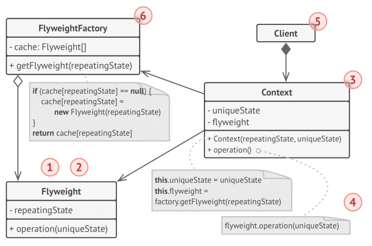
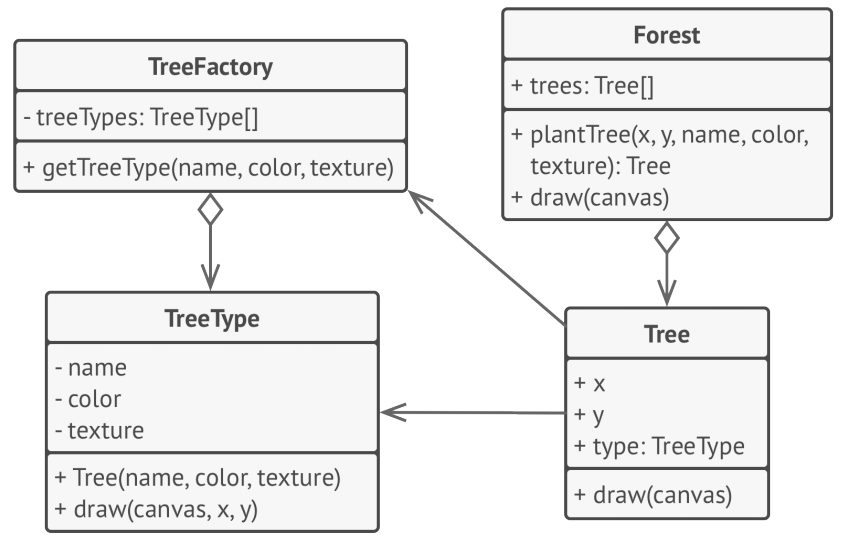

# Flyweight
**Flyweight** is a structural design pattern that lets you fit more objects into the available 
amount of RAM by sharing common parts of state between multiple objects instead of keeping all
of the data in each object.

## Problem
To have some fun after long working hours, you decided to create a simple video game: players 
would be moving around a map and shooting each other. You chose to implement a realistic 
particle system and make it a distinctive feature of the game. Vast quantities of bullets, 
missiles, and shrapnel from explosions should fly all over the map and deliver a thrilling
experience to the player.

Upon its completion, you pushed the last commit, built the game and sent it to your friend for 
a test drive. Although the game was running flawlessly on your machine, your friend wasn’t 
able to play for long. On his computer, the game kept crashing after a few minutes of gameplay.

After spending several hours digging through  debug logs, you discovered that the game crashed 
because of an insufficient amount of RAM. It turned out that your friend’s rig was much less 
powerful than your own computer, and that’s why the problem emerged so quickly on his machine.

The actual problem was related to your particle system. Each particle, such as a bullet, a 
missile or a piece of shrapnel was represented by a separate object containing plenty of data. 
At some point, when the carnage on a player’s screen reached its climax, newly created 
particles no longer fit into the remaining RAM, so the program crashed.

## Solution
On closer inspection of the Particle class, you may notice that the color and sprite fields 
consume a lot more memory than other fields. What’s worse is that these two fields store
almost identical data across all particles. For example, all bullets have the same color and 
sprite.

Other parts of a particle’s state, such as coordinates, movement vector and speed, are unique 
to each particle. After all, the values of these fields change over time. This data represents 
the always changing context in which the particle exists, while the color and sprite remain constant for each particle.

This constant data of an object is usually called the intrinsic state. It lives within the 
object; other objects can only read it, not change it. The rest of the object’s state, often 
altered “from the outside” by other objects, is called the extrinsic state.

The Flyweight pattern suggests that you stop storing the extrinsic state inside the object. 
Instead, you should pass this state to specific methods which rely on it. Only the intrinsic
state stays within the object, letting you reuse it in different contexts.

As a result, you’d need fewer of these objects since they only differ in the intrinsic state, 
which has much fewer variations than the extrinsic.

Let’s return to our game. Assuming that we had extracted the extrinsic state from our particle 
class, only three different objects would suffice to represent all particles in the game: a
bullet, a missile, and a piece of shrapnel. As you’ve probably guessed by now, an object that 
only stores the intrinsic state is called a flyweight.

### Extrinsic state storage
Where does the extrinsic state move to? Some class should still store it, right? In most cases,
 it gets moved to the container object, which aggregates objects before we apply the pattern.

In our case, that’s the main Game object that stores all particles in the particles field. To 
move the extrinsic state into this class, you need to create several array fields for storing
coordinates, vectors, and speed of each individual particle. But that’s not all. You need 
another array for storing references to a specific flyweight that represents a particle. These 
arrays must be in sync so that you can access all data of a particle using the same index.

A more elegant solution is to create a separate context class that would store the extrinsic 
state along with reference to the flyweight object. This approach would require having just
a single array in the container class.

Wait a second! Won’t we need to have as many of these contextual objects as we had at the very 
beginning? Technically, yes. But the thing is, these objects are much smaller than before. The 
most memory-consuming fields have been moved to just a few flyweight objects. Now, a thousand 
small contextual objects can reuse a single heavy flyweight object instead of storing a 
thousand copies of its data.

### Flyweight and immutability
Since the same flyweight object can be used in different contexts, you have to make sure that 
its state can’t be modified.

A flyweight should initialize its state just once, via constructor parameters. It shouldn’t 
expose any setters or public fields to other objects.

### Flyweight factory
For more convenient access to various flyweights, you can create a factory method that manages 
a pool of existing flyweight objects. The method accepts the intrinsic state of the desired 
flyweight from a client, looks for an existing flyweight object matching this state, and 
returns it if it was found. If not, it creates a new flyweight and adds it to the pool.

There are several options where this method could be placed. The most obvious place is a 
flyweight container. Alternatively, you could create a new factory class. Or you could make 
the factory method static and put it inside an actual flyweight class.

## Structure

1. The Flyweight pattern is merely an optimization. Before applying it, make sure your program 
does have the RAM consumption problem related to having a massive number of similar objects in 
memory at the same time. Make sure that this problem can’t be solved in any other meaningful 
way.
1. The Flyweight class contains the portion of the original object’s state that can be shared 
between multiple objects. The same flyweight object can be used in many different contexts.
The state stored inside a flyweight is called “intrinsic.” The state passed to the flyweight’s 
methods is called “extrinsic.”
1. The Context class contains the extrinsic state, unique across all original objects. When a 
context is paired with one of the flyweight objects, it represents the full state of the 
original object.
1. Usually, the behavior of the original object remains in the flyweight class. In this case, 
whoever calls a flyweight’s method must also pass appropriate bits of the extrinsic state into 
the method’s parameters. On the other hand, the behavior can be moved to the context class, 
which would use the linked flyweight merely as a data object.
1. The Client calculates or stores the extrinsic state of flyweights. From the client’s 
perspective, a flyweight is a template object which can be configured at runtime by passing 
some contextual data into parameters of its methods.
1. The Flyweight Factory manages a pool of existing flyweights. With the factory, clients 
don’t create flyweights directly. Instead, they call the factory, passing it bits of the 
intrinsic state of the desired flyweight. The factory looks over previously created flyweights 
and either returns an existing one that matches search criteria or creates a new one if nothing
is found.

## Pseudocode
In this example, the Flyweight pattern helps to reduce memory usage when rendering millions of 
tree objects on a canvas.

The pattern extracts the repeating intrinsic state from a main Tree class and moves it into 
the flyweight class TreeType . Now instead of storing the same data in multiple objects, it’s
kept in just a few flyweight objects and linked to appropriate Tree objects which act as 
contexts. The client code creates new tree objects using the flyweight factory, which 
encapsulates the complexity of searching for the right object and reusing it if needed.

## How to Implement
1. Divide fields of a class that will become a flyweight into two parts:
    * the intrinsic state: the fields that contain unchanging data duplicated across many 
    objects
    * the extrinsic state: the fields that contain contextual data unique to each object
1. Leave the fields that represent the intrinsic state in the class, but make sure they’re 
immutable. They should take their initial values only inside the constructor.
1. Go over methods that use fields of the extrinsic state. For each field used in the method, 
introduce a new parameter and use it instead of the field.
1. Optionally, create a factory class to manage the pool of flyweights. It should check for an 
existing flyweight before creating a new one. Once the factory is in place, clients must only 
request flyweights through it. They should describe the desired flyweight by passing its 
intrinsic state to the factory.
1. The client must store or calculate values of the extrinsic state (context) to be able to 
call methods of flyweight objects. For the sake of convenience, the extrinsic state along with 
the flyweight-referencing field may be moved to a separate context class.
