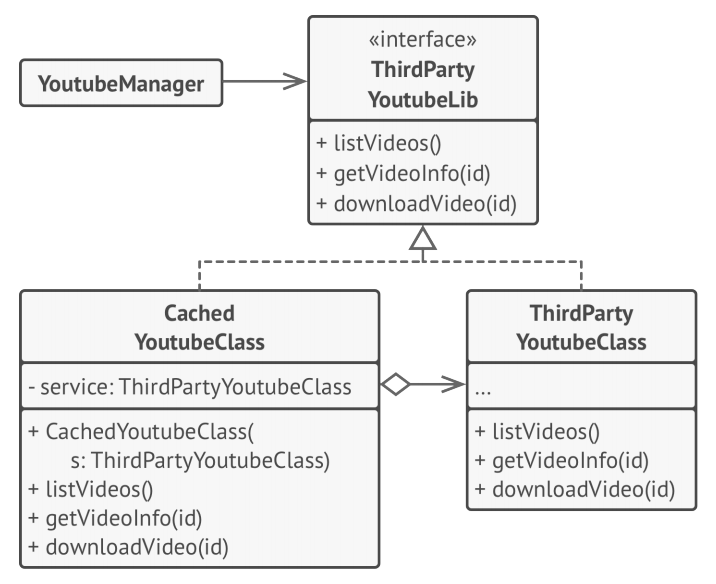

# Proxy
**Proxy** is a structural design pattern that lets you provide a substitute or placeholder for 
another object. A proxy controls access to the original object, allowing you to perform
something either before or after the request gets through to the original object.

## Problem
Why would you want to control access to an object? Here is an example: you have a massive 
object that consumes a vast amount of system resources. You need it from time to time, but
not always.

You could implement lazy initialization: create this object only when it’s actually needed. 
All of the object’s clients would need to execute some deferred initialization code. 
Unfortunately, this would probably cause a lot of code duplication.

In an ideal world, we’d want to put this code directly into our object’s class, but that isn’t 
always possible. For instance, the class may be part of a closed 3rd-party library.

## Solution
The Proxy pattern suggests that you create a new proxy class with the same interface as an 
original service object. Then you update your app so that it passes the proxy object to all of 
the original object’s clients. Upon receiving a request from a client, the proxy creates a 
real service object and delegates all the work to it.

But what’s the benefit? If you need to execute something either before or after the primary 
logic of the class, the proxy lets you do this without changing that class. Since the proxy
implements the same interface as the original class, it can be passed to any client that 
expects a real service object.

## Structure

1. The Service Interface declares the interface of the Service. The proxy must follow this 
interface to be able to disguise itself as a service object.
1. The Service is a class that provides some useful business logic.
1. The Proxy class has a reference field that points to a service object. After the proxy 
finishes its processing (e.g., lazy initialization, logging, access control, caching, etc.), 
it passes the request to the service object. Usually, proxies manage the full lifecycle of 
their service objects.
1. The Client should work with both services and proxies via the same interface. This way you 
can pass a proxy into any code that expects a service object.

## Pseudocode
This example illustrates how the Proxy pattern can help to introduce lazy initialization and 
caching to a 3rd-party YouTube integration library.

The library provides us with the video downloading class. However, it’s very inefficient. If 
the client application requests the same video multiple times, the library just downloads it
over and over, instead of caching and reusing the first downloaded file.

The proxy class implements the same interface as the original downloader and delegates it all 
the work. However, it keeps track of the downloaded files and returns the cached result when 
the app requests the same video multiple times.

## How to Implement
1. If there’s no pre-existing service interface, create one to make proxy and service objects 
interchangeable. Extracting the interface from the service class isn’t always possible, because
you’d need to change all of the service’s clients to use that interface. Plan B is to make the 
proxy a subclass of the service class, and this way it’ll inherit the interface of the service.
1. Create the proxy class. It should have a field for storing a reference to the service. 
Usually, proxies create and manage the whole life cycle of their servers. In rare occasions, a 
service is passed to the proxy via a constructor by the client.
1. Implement the proxy methods according to their purposes. In most cases, after doing some 
work, the proxy should delegate the work to the service object.
1. Consider introducing a creation method that decides whether the client gets a proxy or a 
real service. This can be a simple static method in the proxy class or a full-blown factory
method.
1. Consider implementing lazy initialization for the service object.
