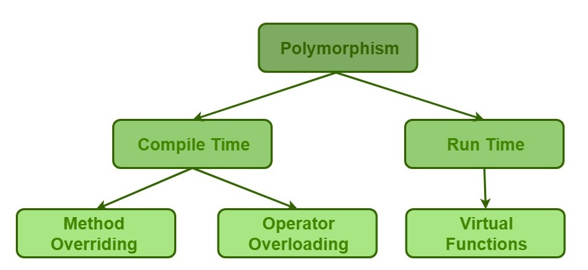

# Classes and Objects
**Class:** A class is the building block, that leads to OOP. Class is a user-defined 
data-type, which holds its own data members and member functions, which can be accessed 
and used by creating an instance of that class.

**Object:** An Object is an instance of a Class. When a class is defined, no memory 
is allocated but when it is instantiated(i.e. an object is created) memory is allocated.
```
class ClassName {
    Access specifier:
        Data members;
        Member functions() { }
};
```
**Declaring Objects:** To use the data and access functions defined in class, you need 
to create objects.
```
ClassName ObjectName;
```
**Access Modifiers:** public, private and protected
**Member Functions in Classes:** Inside and outside class definition. To define function 
outside the class definition we should use **::** scope resolution operator along with 
class name and function name.

# Access Modifiers
It is used to implement in OOP as known as **Data Hiding**.

Access Modifiers or Access Speicifers is a _class_ are used to set the accessibility of the 
class members. That is, it sets some restrictions on the class members not to get directly 
accessed by the outside functions.

Three types of access specifiers:
* public
* private
* protected

**NOTE:** By default access modifier for the members in a class is **_private_**

1. **public** All the class members declared under public will be available to everyone. The 
data members and member functions declared public can be accessed by other classes too. The 
public members of a class can be accessed from anywhere in the program using the direct member 
access operator (.) with the object of that class.

1. **private** The class members declared as private can be accessed only by the functions 
inside the class. They are not allowed to be accessed directly by any object or function 
outside the class. Only the member functions or the friend functions are allowed to access the 
private data members of a class.

1. **protected** Protected access modifier is similar to that of private access modifiers, the 
difference is that the class member declared as Protected are inaccessible outside the class 
but they can be accessed by any subclass(derived class) of that class.

# Inheritance
The capability of a class to derive properties and characteristics from another class is called 
**Inheritance**.
**Sub Class:** The class that inherits properties from another class is called Sub class or 
Derived Class.
**Super Class:** The class whose properties are inherited by sub class is called Base Class or 
Super class.

* Inheritance avoids duplication of data.
* Inheritance increase re-usability.
```
Syntax:
class subclass_name : access_mode base_class_name
{
    // body of subclass
};
```
**NOTE:** A derived class doesn’t inherit **access** to private data members. However, it does 
inherit a full parent object, which contains any private members which that class declares.

## Modes of Inheritance
1. **Public mode:** If we derive a sub class from a public base class. Then the public member 
of the base class will become public in the derived class and protected members of the base 
class will become protected in derived class.
1. **Protected mode:** If we derive a sub class from a Protected base class. Then both public 
member and protected members of the base class will become protected in derived class.
1. **Private mode:** If we derive a sub class from a Private base class. Then both public 
member and protected members of the base class will become Private in derived class.

**NOTE:** The private members in the base class cannot be directly accessed in the derived 
class, while protected memebers can be directly accessed.

## Types of Inheritance
1. **Single Inheritance:** A class is allowed to inherit from only one class. i.e. one sub 
class is inherited by one class only.
1. **Multiple Inheritance:** A class can inherit from more than one classes. i.e. one _sub_ 
_class_ is inherited from more than one _base classes_.
1. **Multilevel Inheritance:** A derived class is created from another derived class.
1. **Hierarchical Inheritance:** More than one sub class is inherited from a single base class. 
i.e. more than one derived class is created from a single base class.
1. **Hybrid (Virtual) Inheritance:** By combining more than one type of inheritance. Its 
combination of hierarchical and multiple inheritance.

# Polymorphism
Means having many forms. Polymorphism as the ability of a message to be displayed in more than 
one form. 
Example:- Like a man at the same time is a father, a husband, an employee. So the same person 
posses different behaviour in different situations. It's called polymorphism.

### Two types of polymorphism
* Compile time Polymorphism
* Runtime Polymorphism

Format: 


